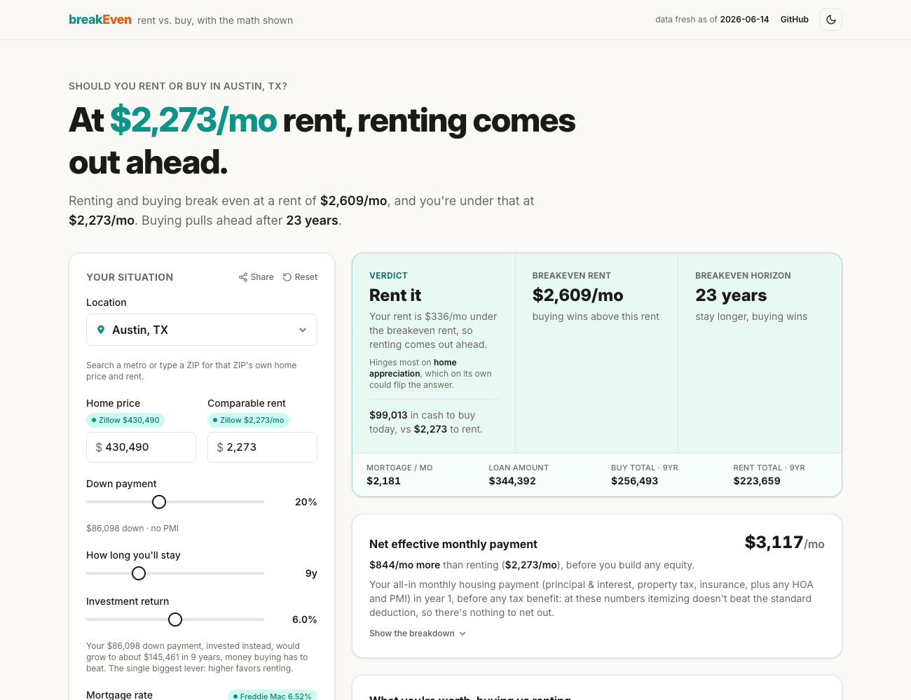
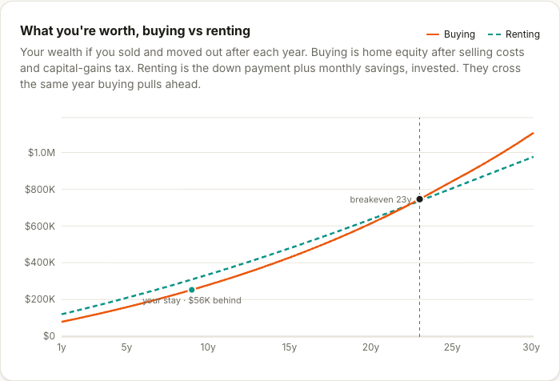
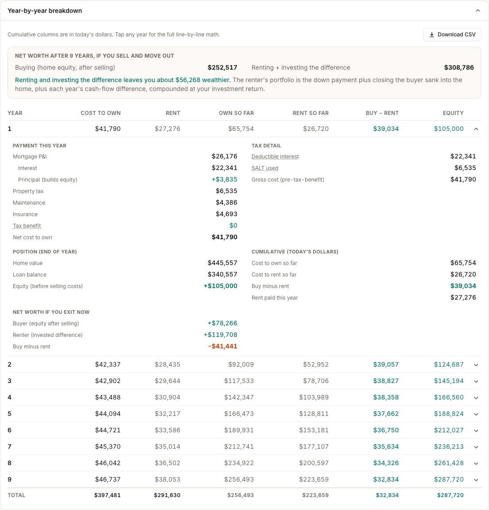

<div align="center">

# breakEven

### Rent vs. buy, with the math shown.

Live mortgage rates, home prices, and single-family rents baked into a static site, plus a year-by-year breakdown of every cost. No accounts, no ads, no lead-gen. The model is a pure, unit-tested module in the repo: [`src/engine/calculator.ts`](src/engine/calculator.ts).

[**breakeven.rent**](https://breakeven.rent) &nbsp;·&nbsp; [Houston](https://breakeven.rent/houston-tx) &nbsp;·&nbsp; [Austin](https://breakeven.rent/austin-tx) &nbsp;·&nbsp; [New York](https://breakeven.rent/new-york-ny) &nbsp;·&nbsp; [/calc](https://breakeven.rent/calc) (quick answer)



</div>

## What it answers

Enter a location (or your own numbers) and it solves for the **breakeven rent**: the monthly rent at which buying and renting come out exactly even. Rent a comparable home for less and renting wins; more and buying wins. It also finds the **breakeven horizon** (the years you'd need to stay before owning pulls ahead), names the single assumption your verdict hinges on, and flags a jumbo loan once your loan crosses the conforming limit.

Every cost of owning, mortgage interest and principal, property tax, maintenance, insurance, PMI, HOA, closing and selling costs, and the investment return you forgo on the down payment, is converted to rent-equivalent dollars and discounted at your own return rate.

## Net worth, not just monthly cost

The verdict isn't "cheaper per month," it's **wealth**. Buying's net worth is home equity after selling costs and capital-gains tax; renting's is the down payment plus every month's cash-flow difference, invested. Both fall out of the same present values, so the two wealth lines cross the exact year the cost lines do.



## The math, shown

No black box. A "how your rates are derived" panel exposes the exact federal and state brackets applied (your row highlighted), the interest-deduction cap, and the live source behind every headline number. The year-by-year table audits every line, with a one-click CSV export of the full dataset.



## The model

A four-bucket cost decomposition (initial, recurring, opportunity, net sale proceeds), grounded in the user-cost-of-homeownership literature (Himmelberg, Mayer &amp; Sinai, 2005). The simulation runs **monthly** for honest amortization, PMI drop-off, and compounding. Breakeven rent is solved in **closed form** (rent enters the cost linearly), so the sensitivity sweep is cheap.

Tax handling is real, not a flat haircut: the mortgage-interest and property-tax deduction is valued at your **federal** marginal rate (it's a federal Schedule A deduction), state and local income tax feeds the SALT base under the cap, and the IRC section 121 capital-gains exclusion applies on sale. Enter income, filing status, and state and it estimates your marginal rate from 2026 brackets.

## Live data

A scheduled GitHub Action pulls fresh public data weekly and bakes it into JSON the static site reads. No server at runtime.

| Input | Source |
| --- | --- |
| Mortgage rates (30/15 yr) | Freddie Mac PMMS (conforming); Optimal Blue OBMMI for the jumbo spread |
| Home prices | Zillow ZHVI, single-family + condo (400+ metros, ~8k ZIPs) |
| Rents | Zillow **single-family** ZORI at metro level; estimated per ZIP from the metro's single-family premium |
| Inflation | BLS CPI-U |
| Appreciation | Conservative long-run default; local 5-yr CAGR offered as a one-tap alternative |
| Property tax / insurance | State effective rates (WalletHub / Census ACS; NAIC HO-3 / Zillow) |
| Income tax | IRS 2026 federal brackets + state DOR tables (50 states + DC) |
| Capital gains | IRS Topic 701 (section 121 exclusion) |

The fetcher ([`scripts/fetch-data.mjs`](scripts/fetch-data.mjs)) is zero-dependency Node. Each source is fetched independently and falls back to the last committed value if it's unreachable, so a flaky upstream never breaks a deploy. On load the page also pulls the latest `market.json` off the repo's jsDelivr mirror (with a bundled fallback), so headline numbers stay current between deploys. Those two keyless GETs (geo + market) are the only runtime network calls.

## Engineering

- **Pure engine, 90 unit tests.** [`calculator.ts`](src/engine/calculator.ts) is side-effect-free; the IRC interest cap, SALT taper, PMI drop-off, and net-worth crossover are all covered.
- **No backend.** A static SPA. Geolocation and the data mirror are the only runtime calls, both keyless and fault-tolerant.
- **Typed data, one source.** Market / location / rate JSON is typed once in [`rates.ts`](src/data/rates.ts); cost keys derive from the registry, so adding a cost extends the type instead of drifting from it.
- **Prerendered for SEO + share.** Every metro and ZIP gets a static page with its own meta and Open Graph card, so `/houston-tx` and `/77002` unfurl with that location's verdict. A sitemap lists them all.

## Develop

```bash
npm install
npm run dev          # local dev server
npm test             # engine + lib unit tests (90)
npm run typecheck    # fresh, full tsc
npm run build        # production build to dist/ (incl. per-metro/ZIP prerender)
npm run fetch-data   # refresh market + metro data (optional)
npm run fetch-zips   # refresh the ZIP table (optional, ~128MB pull)
```

## Deploy

Static SPA on [Vercel](https://breakeven.rent), shipped with `vercel --prod`. The build prerenders a page per metro and ZIP; top markets get a rendered OG card in Vercel Blob. [`ci.yml`](.github/workflows/ci.yml) typechecks, tests, and builds on every push; [`refresh-data.yml`](.github/workflows/refresh-data.yml) runs weekly to pull fresh figures, commit them, re-render the top OG cards, and purge the CDN.

## Caveats

Tax brackets, the SALT cap, and capital-gains rules are simplified and change with law, so treat the deduction math as an estimate. Property tax and insurance are state-level effective rates (they vary by county). Per-ZIP rent is a single-family **estimate** (scaled from the metro premium), labeled as such in the UI. Appreciation defaults to a conservative long-run figure, not recent local run-ups. The investment-return rate doubles as the discount rate, so certain and uncertain flows are discounted alike, a deliberate simplification. **A decision aid, not financial advice.**

## License

MIT
